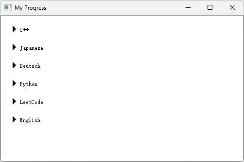
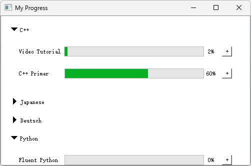

# myprogress-desktop
A simple long-term task desktop application based on PyQt, using CSV as data storage.

## ui

Some long-term main task would be display on the main window. 

sub tasks are in the collapsible box, can be reached by clicking the title of main tasks.

todo-list:
- [ ] daily progress diagram
- [ ] short term task management widget with time counting